# Bike Demand Prediction

Comparison of machine learning models for hourly bike demand prediction.

*Results summary*:

| Model | Test RMSE |
|---|---|
| Ridge Regression | 101.07 |
| Decision Tree | 124.98 |
| XGBoost | 98.17 |

*Dataset*:
- [Bike Sharing Dataset (UCI Machine Learning Repository)](https://archive.ics.uci.edu/ml/datasets/bike+sharing+dataset)

*Running instructions*:

```bash
pip install -r requirements.txt
```

```bash
python main.py
```

## 1. Introduction

- The target variable was the hourly bike rental count.
- Each observation was treated independently (no time-series modeling was used)

The dataset contained information about:
- Weather conditions
- Time-related variables such as hour, weekday, and month

## 2. EDA and Feature Engineering

### 2.1 Missing values

The dataset did not contain any missing values

### 2.2 Time-related variables

- The hourly demand plot showed strong commute-related patterns
- Because of this non-smooth relationship, a one-hot encoding of hour was suitable.
- The other time-related variables (month, weekday) were also one-hot encoded, since this introduced relatively few additional features.

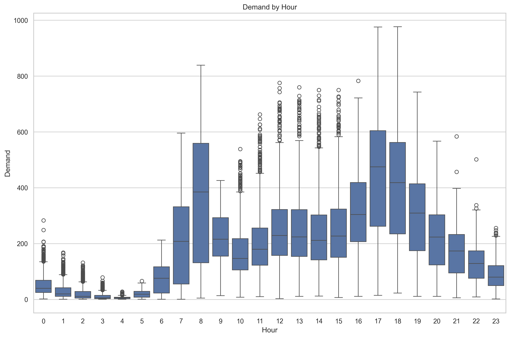

### 2.3 Weather effects

- Windspeed showed the most non-linear relationship
- Windspeed^2 was added as a feature for this reason

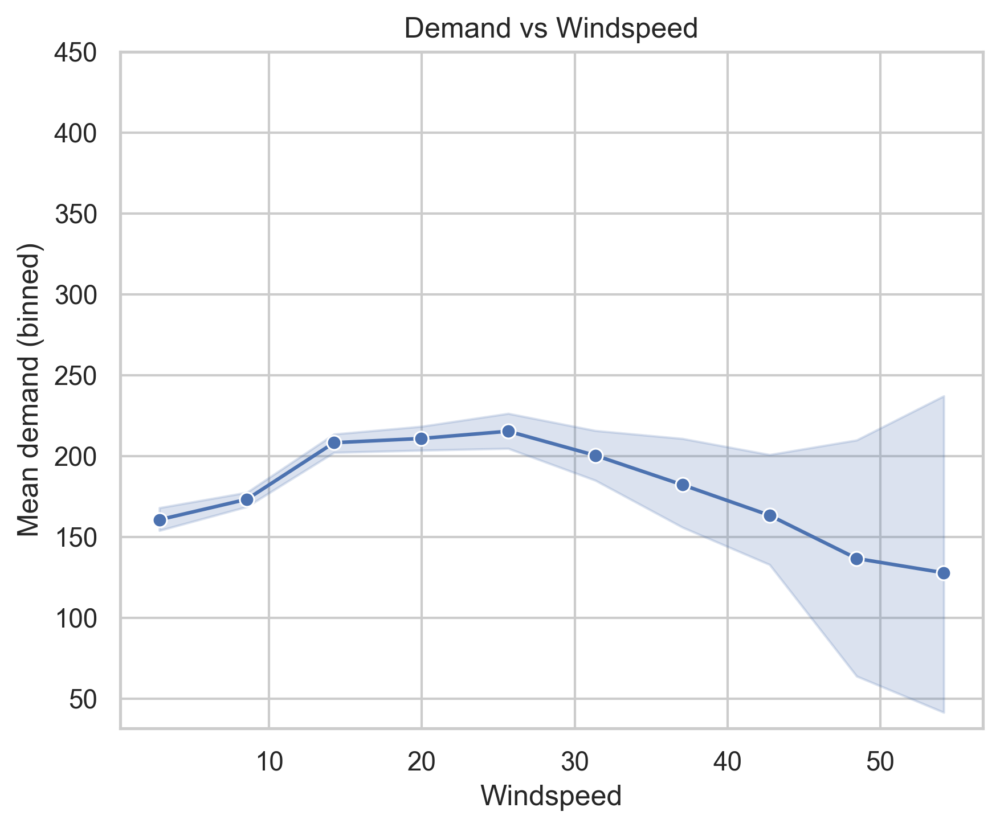

### 2.4 Correlated predictors

- A correlation matrix revealed that `temp` and `atemp` were highly correlated
- To avoid colinear predictors, only `temp` was retained in the final model

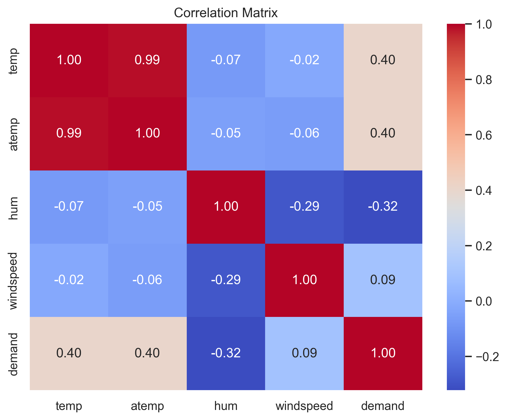

## 3. Preprocessing

Numerical scaling was applied only for Ridge regression, because the tree based models are not sensitive to scale.

## 4. Models

### 4.1 Ridge Regression

A regularized parameter alpha was tuned using the validation RMSE.


### 4.2 Decision Tree

The maximum tree depth was tuned using the validation RMSE.

### 4.3 XGBoost

The following parameters were fixed:

```python
learning_rate = 0.05
n_estimators = 300
```

The maximum depth parameter was tuned using the validation set.

## 5. Hyperparameter Tuning

The split used was 70% training, 15% validation, and 15% test.

The workflow was:

1. Train model on training data
2. Tune hyperparameters using validation data
3. Retrain best model on train + validation data
4. Evaluate final performance on test data

### 5.1 Ridge Regression

- The Ridge validation curve showed that increasing alpha generally worsened performance
- This suggests that the original linear model was not overfitting
- The optimal value for alpha was selected as 0.01

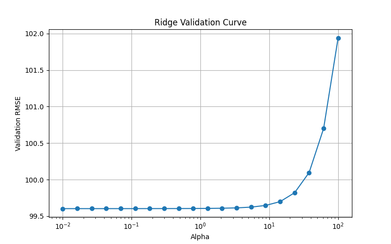

### 5.2 Decision Tree

- Increasing tree depth substantially improved performance initially before overfitting occurred.
- The optimal value for max depth was selected as 13.

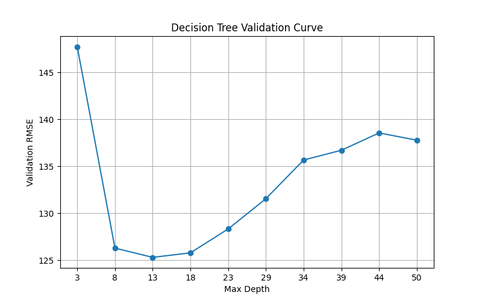

### 5.3 XGBoost

- Increasing tree depth substantially improved performance initially before overfitting occurred.
- The optimal value for max depth was selected as 6.

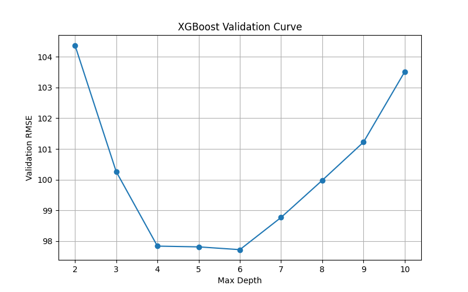

## 6. Test Results

| Model | Test RMSE |
|---|---|
| Ridge Regression | 101.07 |
| Decision Tree | 124.98 |
| XGBoost | 98.17 |

- Decision Tree performed the worst, which is not surprising as single decision trees can only create hard partitions and tend to overfit.
- Ridge Regression performed well, which could make sense given that many of the relationships were approximately linear, and the rest were one-hot encoded. We can see from the scatterplot, as well as the validation curve, that it still had some bias. It was not able to model some non-linear effects.
- XGBoost performed a bit better than Ridge Regression, which could be the remaining non-linear effects and feature interactions it captured.

<table>
  <tr>
    <td align="center">
      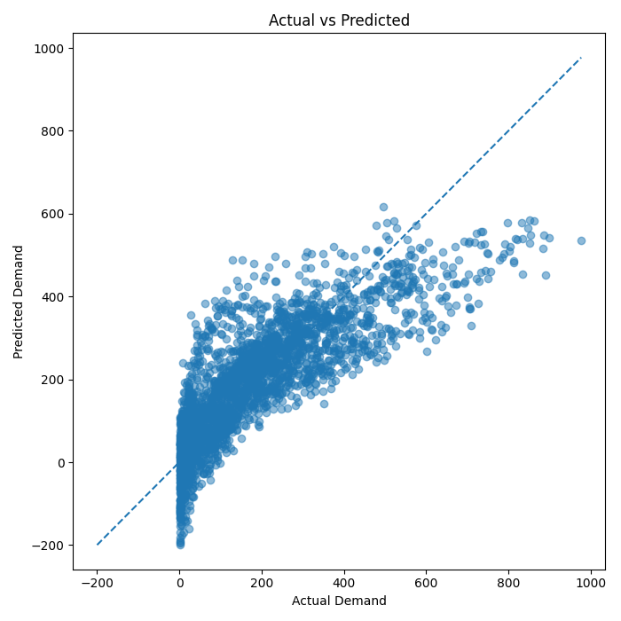<br>
      <em>Ridge Regression</em>
    </td>
    <td align="center">
      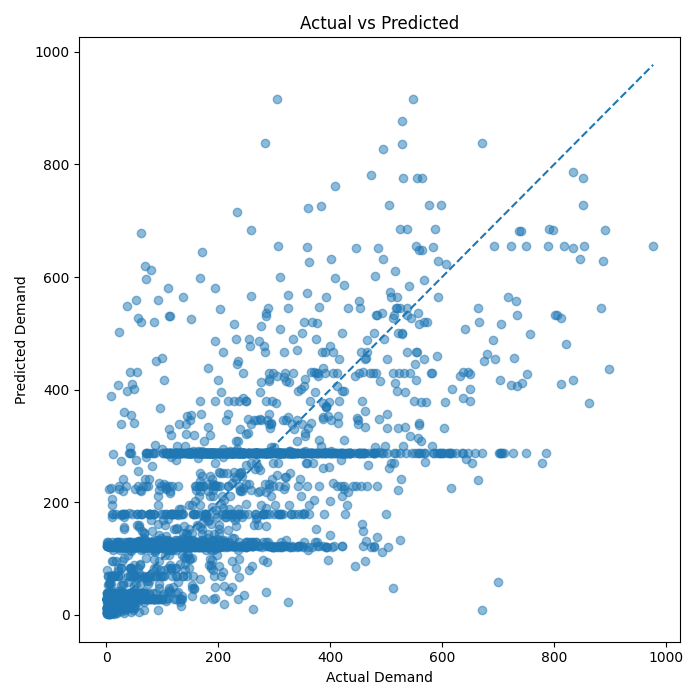<br>
      <em>Decision Tree</em>
    </td>
    <td align="center">
      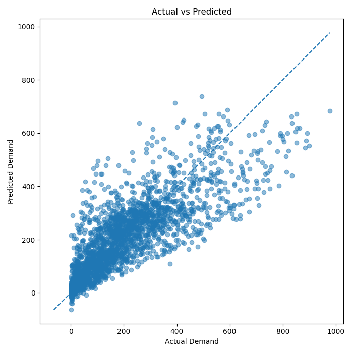<br>
      <em>XGBoost</em>
    </td>
  </tr>
</table>

## 7. Model Interpretation

### 7.1 Ridge Linear Coefficients

Because the features were scaled for the Ridge model, we can directly compare the scale of the coefficients to get an idea of feature importance. The plot shows that the per-hour effects were the most important for prediction. The weather state variable was also highly influential.

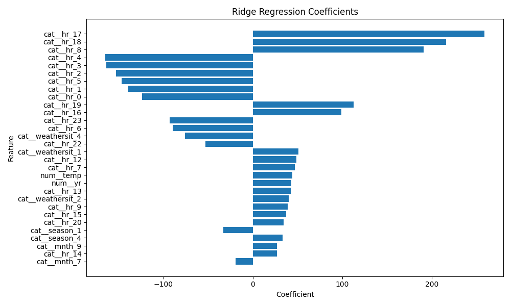

### 7.2 Tree Feature Importance

The decision tree feature importance plot also shows that the per-hour effects were the most important predictors.

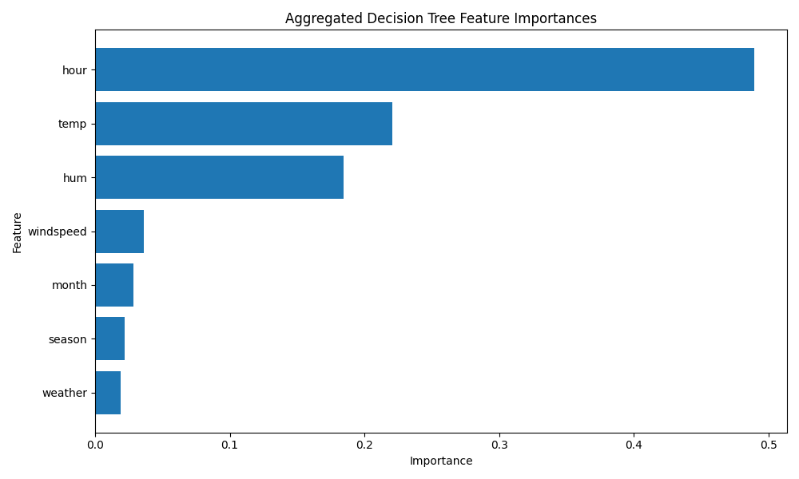

## 8. Conclusion

This project explored several regression approaches for predicting hourly bike demand.

Key findings:
- The results showed that XGBoost achieved the best predictive performance, followed closely by Ridge Regression, while the standalone Decision Tree performed substantially worse.
- The strong performance of Ridge Regression suggests that much of the demand structure was linear, especially after feature engineering was applied.
- XGBoost still achieved the best overall performance, indicating that nonlinear interactions and local threshold effects remained important.
- The most important predictors were the hourly effects, followed by weather effects, as seen from the model interpretation section.
